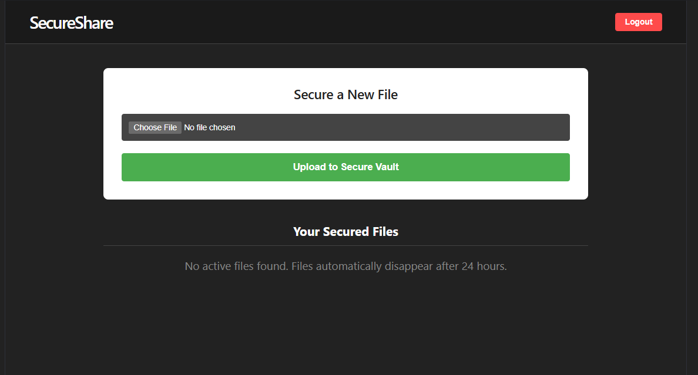

# SecureShare

A 100% serverless, time-limited secure file sharing platform built natively on AWS. SecureShare allows users to upload confidential files to an encrypted vault and generate temporary shareable links. All files and their associated metadata are strictly ephemeral and are mathematically guaranteed to self-destruct exactly 24 hours after upload.

**[View Architecture Diagram](#architecture-overview)**

---

## The Problem & The Solution

**The Problem:** Traditional file sharing platforms leave digital ghost towns—files that are shared once but live on servers forever, creating expanding attack surfaces and unnecessary storage costs.
**The Solution:** SecureShare leverages deep AWS integrations (DynamoDB TTL + EventBridge + ECS Fargate) to enforce strict 24-hour lifespans on all data. It is impossible for a file to exist on the platform past its expiration date.

## Key Technical Highlights

- **Direct-to-S3 Uploads via Presigned URLs:** The React frontend bypasses the API completely during file transmission. An AWS Lambda function generates a cryptographically signed URL, allowing the browser to `PUT` the binary directly into the S3 bucket. This eliminates Lambda payload limits (6MB) and reduces server bottlenecks.
- **Single-Command Infrastructure as Code (IaC):** The entire AWS environment (Networking, Compute, Storage, Database, Auth) is modeled in Terraform. A custom `local-exec` provisioner automatically builds the Python cleanup container and pushes it to ECR during the initial `terraform apply`, achieving true one-step deployment.
- **Zero-Trust Security Posture:** 
  - **S3:** `Block Public Access` is fully enabled. No file can be read without a signed token.
  - **API:** Locked behind Amazon API Gateway with a native Cognito JWT Authorizer.
  - **IAM:** Strict Least-Privilege IAM roles for all Lambdas and Fargate tasks.
- **Dual-Layer Expiry System:**
  - **Layer 1 (Metadata):** DynamoDB native TTL automatically drops expired file rows.
  - **Layer 2 (Storage):** An hourly Amazon EventBridge cron wakes an ECS Fargate container ("The Janitor") which sweeps S3 and destroys any orphaned binary files matching expired database records.

---

## Architecture Overview

The system is broken into three layers: Client, Serverless API, and Automated Cleanup.


### Tech Stack
- **Frontend:** React, Vite, Axios, AWS Amplify (Auth only)
- **Backend Compute:** AWS Lambda (Python 3.11), Amazon ECS Fargate
- **Database & Storage:** Amazon DynamoDB, Amazon S3
- **Security & Auth:** Amazon Cognito, API Gateway (HTTP v2)
- **Infrastructure as Code:** Terraform

---

## Application Screenshots

The main dashboard displays active files within the secure vault. Notice the exact expiration timestamps calculated automatically at upload.



---

## How to Deploy (Single-Command IaC)

Because the architecture relies on Docker and Fargate, **Docker Desktop must be running** on the deploying machine.

1. **Clone the repository & enter the IaC directory:**
   ```bash
   git clone https://github.com/yourusername/secureshare.git
   cd secureshare/terraform
   ```

2. **Deploy the Infrastructure:**
   ```bash
   terraform init
   terraform apply -auto-approve
   ```
   *(This provisions all AWS services, builds the Janitor Docker image, and pushes it to ECR automatically.)*

3. **Configure the Frontend:**
   The Terraform output will provide your Cognito User Pool IDs and API Gateway URL. Create a `.env` file in the `frontend/` directory:
   ```env
   VITE_USER_POOL_ID=your_pool_id
   VITE_USER_POOL_CLIENT_ID=your_client_id
   VITE_API_BASE_URL=your_api_url
   ```

4. **Run the React App:**
   ```bash
   cd ../frontend
   npm install
   npm run dev
   ```

---

## Security & Business Considerations

This project was developed with a focus on both security and cost-efficiency.

- **Cost Efficiency:** At rest, the system costs effectively **$0.00/month**. The entire architecture relies on serverless, pay-per-request pricing (API Gateway, Lambda, DynamoDB On-Demand). The only scheduled compute is the Fargate task, which runs for < 5 seconds per hour, keeping costs negligible.
- **Known Trade-offs:** The Fargate Janitor uses a DynamoDB `scan()` operation. While perfect for this scale and sandbox environment, a production system with millions of records would replace this with DynamoDB Streams triggering a Lambda function to achieve O(1) cleanup efficiency. 
- **CORS & HTTP Fallbacks:** The frontend gracefully handles non-secure contexts (like S3 static HTTP hosting) by dynamically replacing the modern Clipboard API with a native `prompt()` fallback, ensuring shareable links are always accessible.

---
*Developed for CSCI5409 Advanced Topics in Cloud Computing.*
